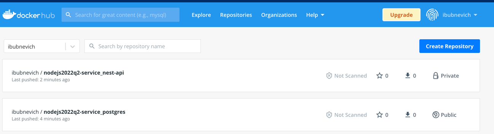

# Home Library Service

## Prerequisites

- Git - [Download & Install Git](https://git-scm.com/downloads).
- Node.js - [Download & Install Node.js](https://nodejs.org/en/download/) and the npm package manager.

## Downloading

```
git clone https://github.com/bababuuui/nodejs2022Q2-service.git
```

## Installing NPM modules

```
npm install
```

## Running application

```
npm start
```
## Running application in dev mode

```
npm start:dev
```
After starting the app on port (4000 as default) you can open
in your browser OpenAPI documentation by typing http://localhost:4000/doc/.
For more information about OpenAPI/Swagger please visit https://swagger.io/.

## Testing

After application running open new terminal and enter:

To run all tests without authorization

```
npm run test
```

To run only one of all test suites

```
npm run test -- <path to suite>
```

To run all test with authorization

```
npm run test:auth
```

To run only specific test suite with authorization

```
npm run test:auth -- <path to suite>
```

### Auto-fix and format

```
npm run lint
```

```
npm run format
```

### Debugging in VSCode

Press <kbd>F5</kbd> to debug.

For more information, visit: https://code.visualstudio.com/docs/editor/debugging


###Docker

**What has been done?**

1. Created 2 dockerfiles

2. Created docker-compose file


3. Implemented npm script for scan vulnerabilities: 

`npm run scan:app --IMAGE nodejs2022q2-service_nest-api`


4. Pushed docker images to ducker hub:   


**How to build and run images:** 

Make sure your .env file has vars according to .env.example file

run in terminal `docker compose up -V`